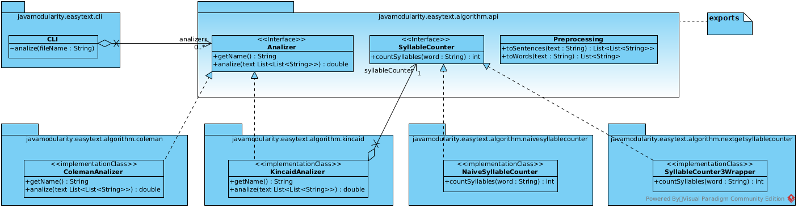

# Project "easytext.hk2".
See the original project [easytext-guice](https://github.com/java9-modularity/easytext-guice)
## Purpose of the project.
Compare the implementation encapsulation capabilities when using [google guice](https://github.com/google/guice) and [glassfish hk2](https://eclipse-ee4j.github.io/glassfish-hk2/) with [java modules](https://www.oracle.com/corporate/features/understanding-java-9-modules.html).
## Project class diagram.

## Result.
When using [google guice](https://github.com/google/guice) and [java modules](https://www.oracle.com/corporate/features/understanding-java-9-modules.html) we have encapsulation at the [java modules](https://javamodularity.com/) level, when using [glassfish hk2](https://eclipse-ee4j.github.io/glassfish-hk2/) and [java modules](https://www.oracle.com/corporate/features/understanding-java-9-modules.html) we have encapsulation at the [java modules](https://www.oracle.com/corporate/features/understanding-java-9-modules.html) and [java package](https://en.wikipedia.org/wiki/Java_package) levels.
## How to compile.
* [JDK 17](https://adoptium.net/) required.
* cd easytext-hk2
* mvn clean package -P cli
* or mvn clean package -P gui

Distributions can be found in the easytext.hk2.cli.target and easytext.hk2.gui.target directories.

## See also.
1. [Liskov substitution principle](https://en.wikipedia.org/wiki/Liskov_substitution_principle)
2. [Dependency inversion principle](https://en.wikipedia.org/wiki/Dependency_inversion_principle)
3. [SOLID](https://en.wikipedia.org/wiki/SOLID)
4. [Java 9 Modularity](https://javamodularity.com/)